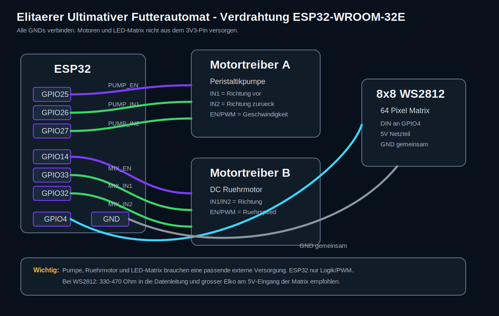
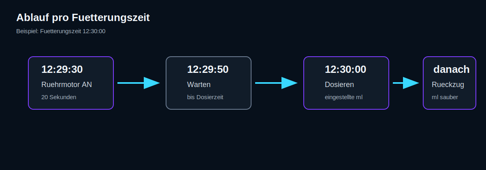

# Futterautomat Vita - bebilderte Bauanleitung

Diese Anleitung beschreibt den Aufbau fuer einen ESP32-WROOM-32E mit einer vor/zurueck drehenden Peristaltikpumpe, einem DC-Ruehrmotor und einer 8x8 WS2812 LED-Matrix.



## Funktion



Pro Fuetterungszeit passiert automatisch:

1. 30 Sekunden vor der eingestellten Zeit startet der DC-Ruehrmotor.
2. Der Ruehrmotor laeuft 20 Sekunden.
3. Danach wartet das System bis zur exakten Fuetterungszeit.
4. Die Peristaltikpumpe dosiert die eingestellte Futtermenge.
5. Danach dreht die Pumpe rueckwaerts und zieht die eingestellte Rueckzugsmenge ein.

## WLAN Setup

Die WLAN-Daten muessen nicht im Code eingetragen werden.

Beim ersten Start oder wenn das gespeicherte WLAN nicht erreichbar ist, oeffnet der ESP32 diesen Setup-Hotspot:

```text
SSID: Futterautomat-Setup
Passwort: futter1234
Adresse: http://192.168.4.1
```

Viele Handys zeigen automatisch ein Anmeldefenster. Falls nicht, verbinde dich mit dem Hotspot und oeffne `http://192.168.4.1` im Browser. Dort kannst du WLAN-Name und Passwort eintragen. Nach erfolgreicher Verbindung schliesst der ESP32 den Hotspot und ist im Haus-WLAN ueber seine Router-IP erreichbar.

## Bauteile

- ESP32-WROOM-32E Dev Board
- Peristaltikpumpe mit DC-Motor
- DC-Ruehrmotor
- 2 Motortreiber-Kanaele, z. B. TB6612FNG, L298N oder DRV8833
- 8x8 WS2812 LED-Matrix mit 64 LEDs
- Externes Netzteil passend zu Motoren und LED-Matrix
- Schlaeuche fuer Fluessigfutter
- Rueckschlagventil, wenn mechanisch sinnvoll
- Gemeinsame Masseleitung
- Optional: 330-470 Ohm Widerstand in der WS2812-Datenleitung
- Optional: 470-1000 uF Elko am 5V-Eingang der LED-Matrix

## Pinbelegung

| Funktion | ESP32 Pin | Anschluss |
|---|---:|---|
| Pumpe PWM / Enable | GPIO25 | EN/PWM am Pumpen-Motortreiber |
| Pumpe Richtung 1 | GPIO26 | IN1 am Pumpen-Motortreiber |
| Pumpe Richtung 2 | GPIO27 | IN2 am Pumpen-Motortreiber |
| Ruehrmotor PWM / Enable | GPIO14 | EN/PWM am Ruehrmotor-Motortreiber |
| Ruehrmotor Richtung 1 | GPIO33 | IN1 am Ruehrmotor-Motortreiber |
| Ruehrmotor Richtung 2 | GPIO32 | IN2 am Ruehrmotor-Motortreiber |
| WS2812 Datenleitung | GPIO4 | DIN der 8x8 Matrix |
| Masse | GND | GND von Netzteil, Treibern, LED-Matrix und ESP32 verbinden |

## Wichtige Hinweise zur Stromversorgung

Der ESP32 darf die Motoren und die LED-Matrix nicht direkt versorgen. Nutze ein externes Netzteil fuer Motoren und LEDs. Wichtig ist, dass alle GND-Leitungen verbunden sind:

- GND ESP32
- GND Motortreiber
- GND Motor-Netzteil
- GND LED-Matrix

Die WS2812-Matrix kann bei voller Helligkeit viel Strom ziehen. Eine 8x8 Matrix hat 64 LEDs. Bei Weiss und voller Helligkeit koennen theoretisch bis zu ca. 3,8 A fliessen. In diesem Projekt sollte die Helligkeit begrenzt werden.

## Aufbau Schritt fuer Schritt

1. ESP32 noch nicht mit den Motoren verbinden.
2. Motortreiber fuer die Peristaltikpumpe anschliessen.
3. Pumpe an den Ausgang des Motortreibers anschliessen.
4. GPIO25, GPIO26 und GPIO27 mit dem Pumpen-Motortreiber verbinden.
5. Motortreiber fuer den Ruehrmotor anschliessen.
6. Ruehrmotor an den zweiten Motortreiber-Ausgang anschliessen.
7. GPIO14, GPIO33 und GPIO32 mit dem Ruehrmotor-Motortreiber verbinden.
8. WS2812 Matrix mit 5V und GND versorgen.
9. GPIO4 ueber optional 330-470 Ohm an DIN der Matrix anschliessen.
10. Alle GNDs miteinander verbinden.
11. ESP32 per USB flashen.
12. Im seriellen Monitor die IP-Adresse ablesen.
13. Browser im gleichen Netzwerk oeffnen und die IP-Adresse aufrufen.

## Kalibrierung

1. Schlauch mit Fluessigfutter fuellen.
2. Eine definierte Zeit pumpen, z. B. 10 Sekunden.
3. Ausgetretene Menge in ml messen.
4. `mlPerSec` berechnen:

```text
mlPerSec = gemessene_ml / sekunden
```

Beispiel:

```text
25 ml in 10 Sekunden = 2.5 ml/s
```

## Rueckzugsmenge einstellen

Die Rueckzugsmenge ist die Menge, die nach der Dosierung wieder zurueckgezogen wird. Sie soll den Schlauch sauber halten, aber nicht zu viel Futter aus dem Aquarium oder Luft in ungewollte Bereiche ziehen.

Starte vorsichtig, z. B. mit 2-5 ml, und pruefe mechanisch, ob der Schlauch danach sauber bleibt.

## GitHub Pages Simulation

Die Simulation liegt im Ordner `docs/`.

GitHub Pages aktivieren:

1. Repository auf GitHub oeffnen.
2. `Settings` oeffnen.
3. `Pages` auswaehlen.
4. Source auf `Deploy from a branch` stellen.
5. Branch `main` waehlen.
6. Folder `/docs` waehlen.
7. Speichern.

Danach ist die Simulation unter einer Adresse wie dieser erreichbar:

```text
https://DEINNAME.github.io/REPOSITORY-NAME/
```
